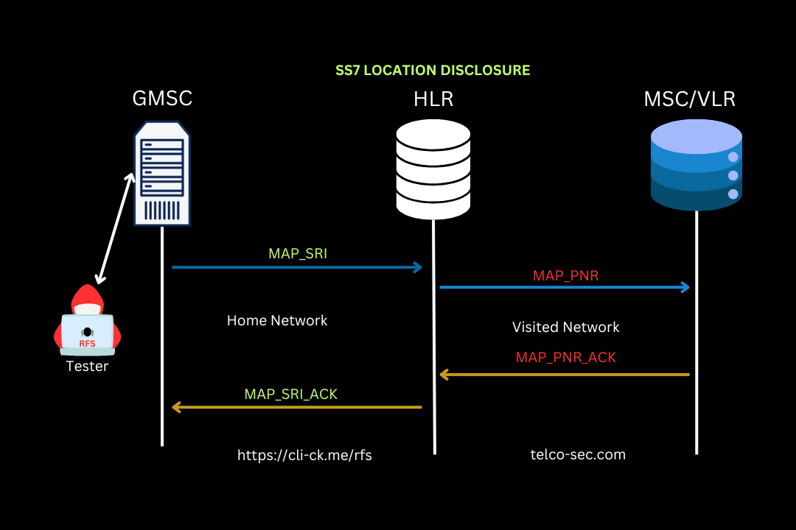

# MAP\_SRI

#### **Location Disclosure Using Call Setup Messages**

Location disclosure using call setup messages is a process where the mobile network determines the geographical location of a mobile subscriber during the initial stages of a call setup. This is typically achieved through specific signaling messages and network components.&#x20;

When a call is initiated, the network leverages information such as IMSI, MSRN, and cell ID obtained during the MAP\_SRI procedure to approximate the subscriber's location.&#x20;

This information is crucial for call routing, location-based services, and emergency services, ensuring both efficient connectivity and regulatory compliance.

<figure><figcaption></figcaption></figure>

#### **SS/MAP MAP\_SRI (Send Routing Information)**

The MAP\_SRI (Send Routing Information) is a signaling message used in GSM mobile networks. It is part of the Mobile Application Part (MAP) protocol, implemented by the Signaling System No. 7 (SS7).

The main purpose of MAP\_SRI is to obtain routing information necessary for delivering a call to the correct destination.

* **Purpose**: To fetch the International Mobile Subscriber Identity (IMSI) and Mobile Station Roaming Number (MSRN) for call routing purposes.
*   **Procedure**:

    1. When a call is initiated, the originating network sends an MAP\_SRI message to the Home Location Register (HLR) of the recipient.
    2. The HLR uses the recipient's information to determine their current location.
    3. The HLR responds with the IMSI and MSRN, allowing the network to route the call appropriately.

    This process is essential for seamless connectivity and efficient call delivery in GSM networks.

The MAP\_SRI (Send Routing Information) is crucial for routing calls in GSM networks.&#x20;

When a call is initiated, the network must determine the recipient's current location to deliver the call efficiently.&#x20;

The MAP\_SRI message is sent to the recipient's Home Location Register (HLR), which responds with critical routing information—the International Mobile Subscriber Identity (IMSI) and Mobile Station Roaming Number (MSRN).&#x20;

This ensures the call reaches the correct destination smoothly, maintaining seamless connectivity across mobile networks.

The MAP\_SRI process is critical in GSM networks for fetching routing information like IMSI and MSRN, allowing efficient call delivery.&#x20;

When a call starts, the originating network sends a MAP\_SRI message to the recipient's HLR, determining their location and enabling seamless connectivity for call routing.
